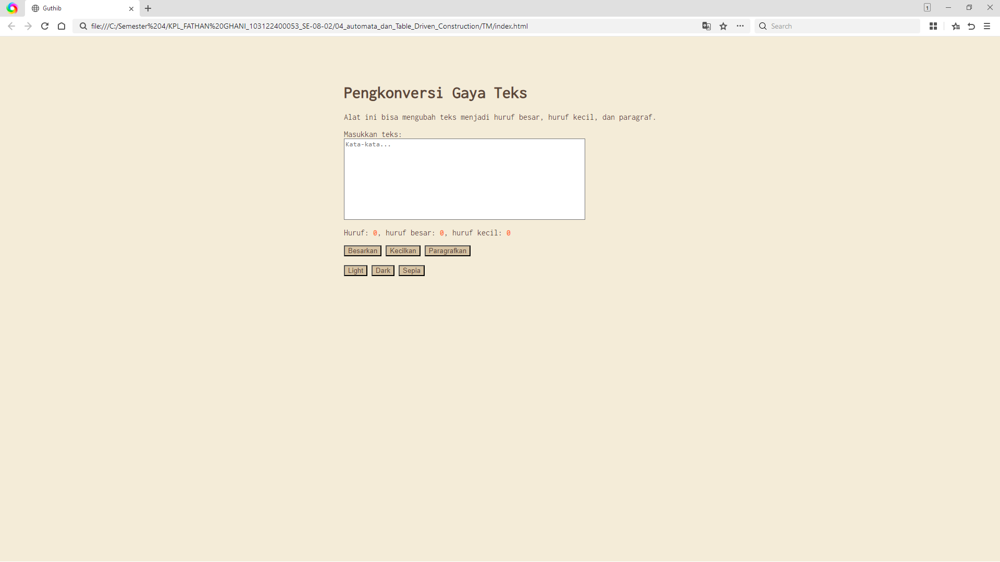
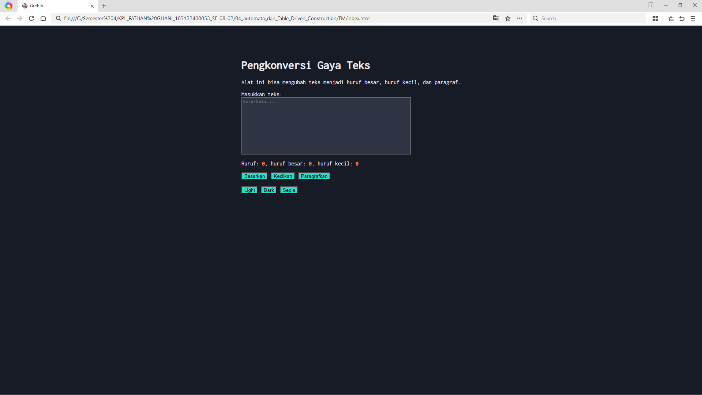
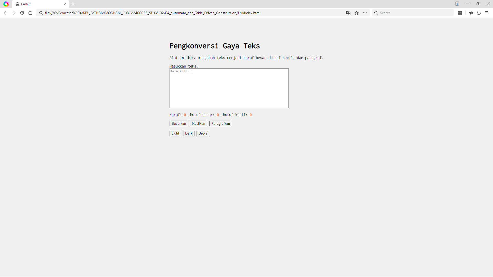

# Tugas Pendahuluan 04: GUI dengan HTML dan CSS
## Soal

Tambahkan mode sepia dengan ketentuan: Elemen Warna Latar belakang #F4ECD8 Warna teks 	#5B4636 Ketentuan lainnya: Bagian mode-div harus menaungi tiga button: light, dark, dan sepia Bisa berpindah state secara mulus: sepia menghasilkan sepia-mode, dark menghasilkan dark-mode, dan light menghasilkan light-mode

## Kode sumber

Tersedia di index.html, index.css dan index.js

## Output

## Deskripsi Program

Otomata adalah mesin abstrak yang mengurai input ke dalam berbagai keadaan, disebut state, tahap demi tahap, hingga sampai pada state yang diinginkan (atau tidak diinginkan). Otomata terdiri dari satu atau sekumpulan state dihubungkan oleh transisi (panah) yang memungkinkan sistem berpindah dari satu state ke state lainnya. Setiap otomata memiliki awal state dan akhir state, dan perpindahannya dipicu oleh masukan.